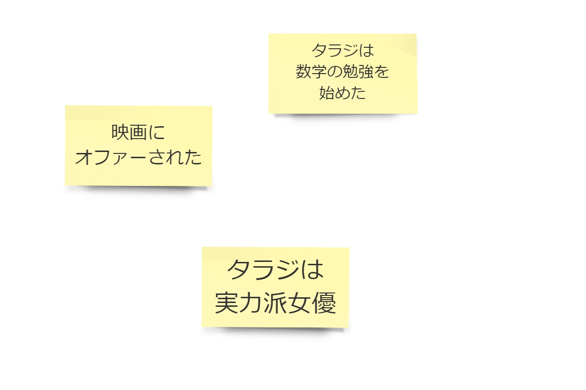
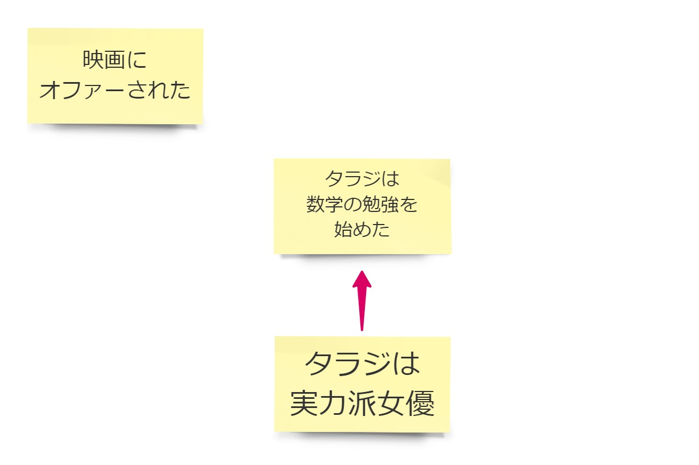
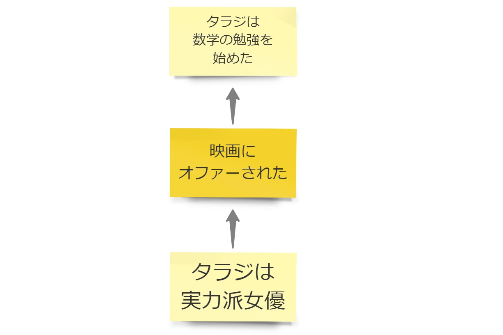
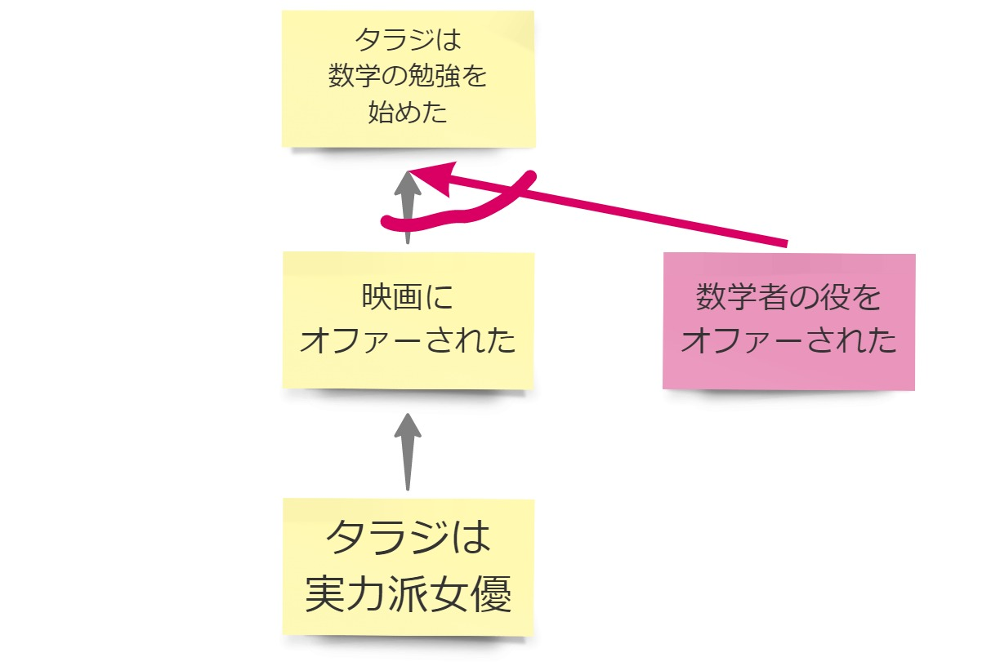

@title[デモ]
## お題

女優タラジは、ある史実を元にした映画のオファーをもらってから数学の勉強を始めた。  
幼いころエンジニアになりたいと夢想しながらも女優になったタラジは、映画界で評価を得ている実力派女優だ。

---

@title[おさらい:つなげて読む]
### 出来事を付箋に書いてつなげて読む

---

---

---

@title[おさらい:並び替えて読む]
### 付箋を並び替える

---

@title[おさらい:理由]
### 理由を付箋に書く

