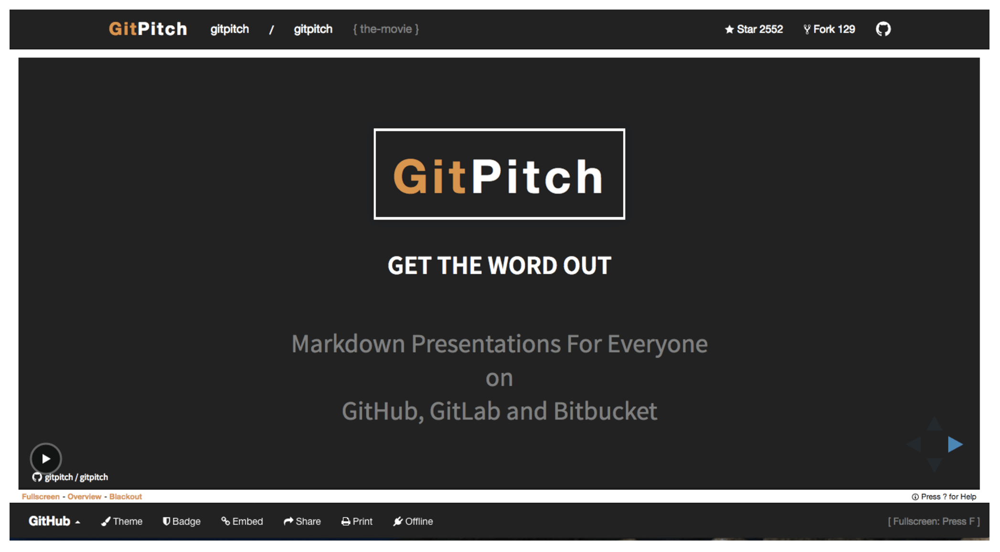
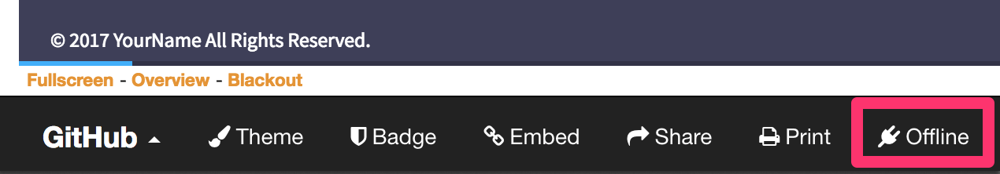

---?image=assets/cover.jpg&size=cover

# gitpitch-azusa

2017.07.29 TokyuRubyKaigi

[@yhirano55](https://github.com/yhirano55)

---

# [@yhirano55](https://github.com/yhirano55)


- Freelancer from 鎌倉
- Organizer [\#railsdm](https://rails-developers-meetup.connpass.com/)

---

# [GitPitch](https://gitpitch.com/)

## 使用したことありますか!?

---



---

# 使い方

1. リポジトリのルートに `PITCHME.md` を作成
2. ホストを `github.com` から `gitpitch.com` に変更
3. Revael.jsのスライドが表示される

---

# よさ

- 内部は [Reveal.js](http://lab.hakim.se/reveal-js/#/)
- `PITCHME.md` を置くだけ
- セットアップらくちん
- ブランチでプレゼン切替可能
- [Wiki](https://github.com/gitpitch/gitpitch/wiki)が充実している

---

# わるさ

- カスタマイズ必須
- 日本語フォント考慮なし
- PDFのフォントやばい
- [Wiki](https://github.com/gitpitch/gitpitch/wiki)を読むの大変

---

# とはいえ<br>使ってみると<br>便利なので

---

## 日本語フォントを考慮し
# AZUSA化してみた

---

# [AZUSA?](http://sanographix.github.io/azusa-colors/)

---


CREATED & MAINTAINED BY [@SANOGRAPHIX](http://www.sanographix.net/)

---

# Keynote用
# 定番 && 鉄板
# テンプレート

---

# 配色

<table style="border: 3px solid #fff;table-layout: fixed;">
  <tr>
    <td style="background: #1ca8f4;text-align: center;">BLUG</td>
    <td style="background: #1fbbd4;text-align: center;">CIAN</td>
    <td style="background: #32b490;text-align: center;">GREEN</td>
    <td style="background: #3e4057;text-align: center;">NAVY</td>
  </tr>
  <tr>
    <td style="background: #fd9026;text-align: center;">ORANGE</td>
    <td style="background: #fc3f80;text-align: center;">PINK</td>
    <td style="background: #b867c6;text-align: center;">PURPLE</td>
    <td style="background: #fc5152;text-align: center;">RED</td>
  </tr>
</table>

---?image=bg/blue.png

# コード

```ruby
require "active_support"
require "active_support/rails"
require_relative "action_cable/version"

module ActionCable
  extend ActiveSupport::Autoload

  INTERNAL = {
    message_types: {
      welcome: "welcome".freeze,
      ping: "ping".freeze,
      confirmation: "confirm_subscription".freeze,
      rejection: "reject_subscription".freeze
    },
```

---?image=bg/cian.png

# 引用

> あのイーハトーヴォのすきとおった風、夏でも底に冷たさをもつ青いそら、うつくしい森で飾られたモリーオ市...

---?image=bg/green.png

# リスト

1. 最初のアイテム
2. 異なるアイテム
  * サブリスト
1. 実際とは異なる番号
  1. サブリスト
4. 最後のアイテム

---?image=bg/orange.png

# テーブル

| Tables        | Are           | Cool  |
| ------------- |:-------------:| -----:|
| col 3 is      | right-aligned | $1600 |
| col 2 is      | centered      |   $12 |
| zebra stripes | are neat      |    $1 |

---?image=bg/pink.png

# インライン画像


---?image=assets/background.jpg&size=cover

# 背景画像

---?image=bg/green.png

# 背景画像の<br>指定方法

---?image=bg/green.png

    ---?image=bg/blue.png

    # Languages

    ## Japanese

hrにクエリを追加するだけ

---?image=bg/cian.png

# オフライン編集

---?image=bg/cian.png



フッターから `PITCHME.zip` をダウンロード

---?image=bg/cian.png

```
$ ruby -rwebrick -e'WEBrick::HTTPServer.new(:Port => 3000, :DocumentRoot => Dir.pwd).start'
```

Zipを解凍してサーバーを起動

---?image=bg/pink.png

# Forkするだけで
# すぐに使えます

### [yhirano55/gitpitch-azusa](https://github.com/yhirano55/gitpitch-azusa)

---?image=bg/pink.png

# ご静聴有難う
# ございました
